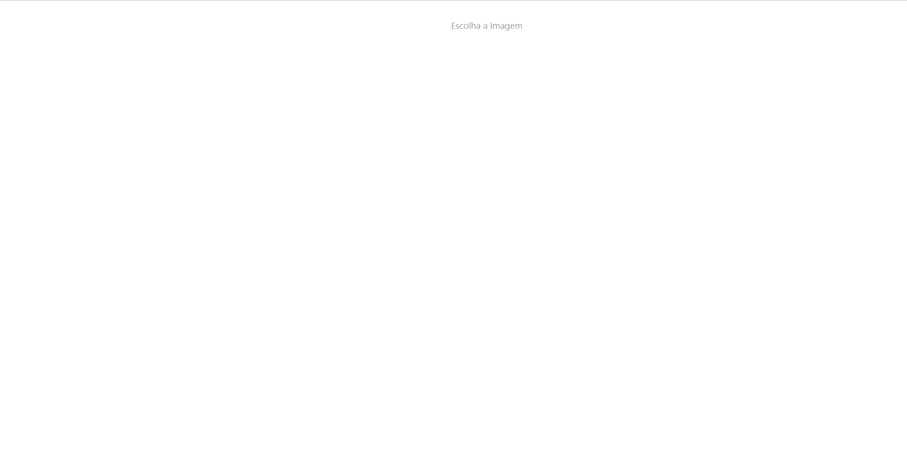

## 💰 Upload de imagens em React

### Aplicação que permite você clicar em um botão e escolher qualquer imagem em seu computador para a mesma ser exibida na tela Instantaneamente após escolhida. você pode deletar a mesma imagem após exibida na tela

## 🖥️ Algumas Telas Do Projeto

## 💻 Tecnologias Usadas

 

## Instalação 

#### Clone o Projeto Com:  

git clone https://github.com/JoaoRicardo2005/sistema-de-transacoes-blockchain-contratos-inteligentes
#### Entre na pasta e instale as dependências com: 
 Yarn
#### Com tudo correto você pode iniciar o servidor com:
yarn start
#### Se você estiver no ambiente de desenvolvimento, poderá usar o servidor de desenvolvimento:
yarn dev 
yarn queue
## Importante 💛

### a aplicação foi totalmente feita por mim joão ricardo mas você pode usar ela do jeito que preferir! seja para estudo,apoio nos estudos ou até para ganhar dinheiro quem sabe rsrs. entre em contato em joaobarbanti7@gmail.com.

